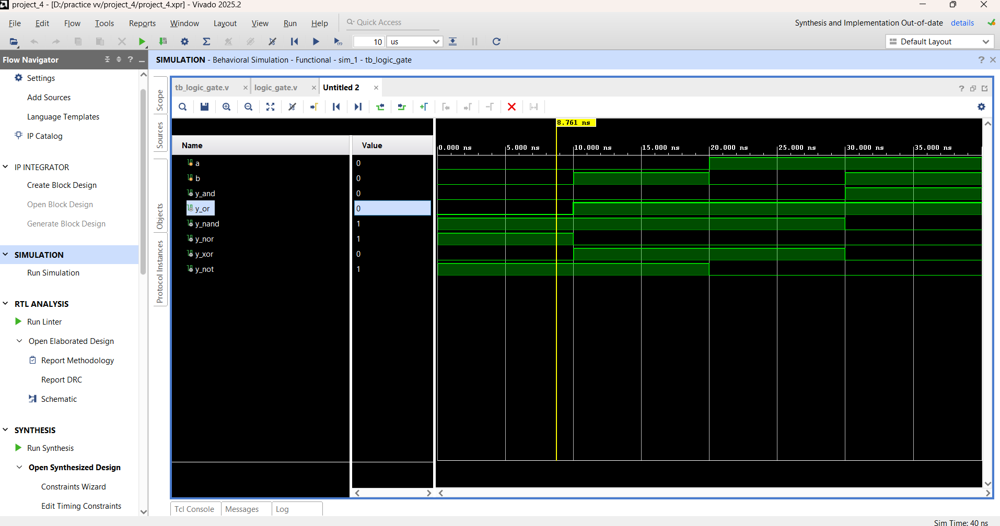
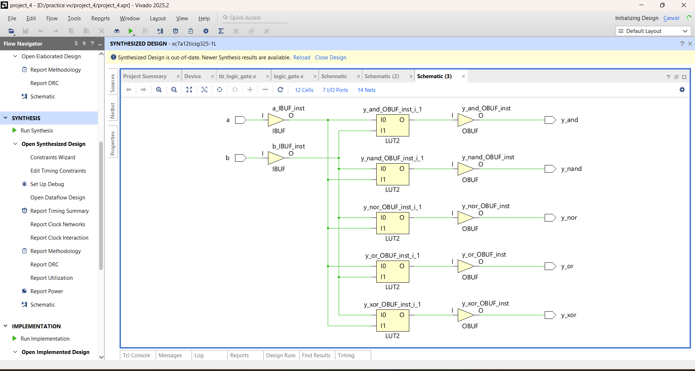

# All Gates Combined Design

After implementing individual logic gates, this project integrates all of them into a single Verilog module.

---

## 🔹 Implementation

This design includes all fundamental logic gates:

- AND  
- OR  
- NOT  
- NAND  
- NOR  
- XOR  
- XNOR  

All gates are combined into a **single multi-output combinational circuit**.

---

## 🛠 Tools Used

- Verilog HDL  
- Xilinx Vivado  

---

## ⚙️ What I Did

- Designed a **multi-output combinational circuit**
- Integrated all basic logic gates into one module
- Created a **testbench for verification**
- Simulated the design and observed waveform
- Analyzed **RTL schematic**
- Performed **synthesis**

---

## 📁 Project Files

| File Name | Description |
|----------|------------|
| `logic_gate.v` | Main Verilog design (all gates combined) |
| `tb_logic_gate.v` | Testbench for simulation |
| `logic gate waveform.png` | Simulation waveform output |
| `RTL Schematic logic gate.png` | RTL design view |
| `logic gate synthesis schematic .png` | Synthesized circuit |

---

## 📊 Output Results

### 🔹 Waveform

### 🔹 RTL Schematic

### 🔹 Synthesis Design

---

## 🎯 Learning Outcome

- Understanding of **combinational circuit design**
- Integration of multiple logic gates in one module
- Writing and debugging **testbench**
- Interpreting waveform results
- Analyzing RTL and synthesis output

---

## 🚀 Reflection

This project helped in connecting individual gate concepts into a **complete working system**, improving both design and debugging skills in Verilog.

---
